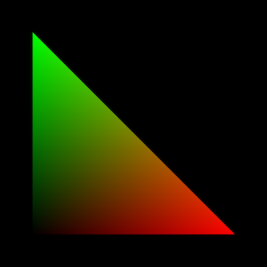

# Computergrafik - Aufgabenblatt 1 - WiSe 2023/24
Prof. Dr. Kathrin Ungru
Peter Weßeler, M.Sc.

## Ziel
Dieses Praktikum dient zur Einarbeitung in die einzelnen Komponenten von WebGL 2.0 (OpenGL ES 3.0 / GLSL ES 3.00). Sie erarbeiten sich Grundlagen der objektorientierten Programmierung mit TypeScript und der OpenGL Rendering Pipeline. Sie beschäftigen sich zudem mit den Grundprinzipien des Grafikstandards und erstellen erste 2D/3D Objekte mittels OpenGL Grafik-Primitiven und Shadern.

## Spielregeln
Das Praktikum gilt als bestanden, wenn alle Aufgaben dieses Arbeitsblattes erfolgreich bearbeitet und vorgestellt wurden. Bereiten Sie Ihre Abgabe gut vor. Ergänzen Sie jede Aufgabe mit handschriftlich Skizzen und Erklärungen, die sie am Ende präsentieren können.
	

## Material
- [WebGL Dokumentation](https://developer.mozilla.org/en-US/docs/Web/API/WebGL_API)
- [WebGL Tutorial](https://webgl2fundamentals.org)
- [glMatrix Dokumentation](http://glmatrix.net)
- [TypeScript Dokumentation](https://www.typescriptlang.org/)

## Vorbereitung
Zur Vorbereitung folgen Sie den Anweisungen auf [git-repository](https://git.fh-muenster.de/vclab/cg/cg-wise23-prep/-/blob/main/README.md)

## Aufgabe 1 - Einstieg in die Shader Programmierung

>**Hinweis:** Testen Sie zunächst, ob Ihr System den technischen Anforderungen des Praktikums entspricht und rufen Sie folgende Seite auf:
[WebglSamples](https://webglsamples.org/WebGL2Samples/\#glsl_flat_smooth_interpolators).
Zumeist reicht ein Update der Grafiktreiber oder unter Unix/Linux die Aktivierung proprietärer Grafiktreiber. 
Es wird empfohlen die Entwicklertools des Firefox zu nutzen. Hier können verschiedene Werkzeuge über die Werkzeugeinstellungen ein- und ausgeschaltet werden. 

Analysieren Sie den gegebenen Quelltext. An welcher Stelle des Codes werden Fragment- und Vertex-Shader eingebunden? Wozu dienen sie jeweils? Und auf welchen Daten arbeiten sie?

Ändern Sie die Farbe des Dreiecks im Fragment-Shader, indem Sie die **Vertex-Koordinaten als Farbwerte** interpretieren. Wie lassen sich die Pixel-Farbwerte im Fragment-Shader aus den Vertex-Koordinaten im Vertex-Shader ermitteln? Wie behandeln Sie Koordinaten, die außerhalb des Farbbereiches liegen?

*Zielbild*

## Aufgabe 2 - Grafische Grundobjekte
Zeichnen Sie zunächst ein Viereck (neue Klasse), welches sich aus zwei Dreiecken zusammensetzt.

Zeichnen Sie im zweiten Schritt einen aus Vierecken zusammengesetzten Quader (neue Klasse) mit gleich langen Seiten. Achten Sie darauf, dass die Frontseiten des Quaders nach außen zeigen. 

Skizzieren Sie den Quader auf Papier. Fügen Sie ihrem Code entsprechende Kommentare hinzu, so dass sich Ihr Ergebnis auf der Skizze nachvollziehen lässt.

## Aufgabe 3 - Objekt Inspizieren
Fügen Sie in der Szene eine Tastatursteuerung ein (Klasse *KeyboardDemo* in */src/keyboard*). Rotieren Sie dabei die Welt, so dass das Objekt aus allen Positionen betrachtet werden kann. 

Zur Berechnung der Rotationsmatrix nutzen Sie glMatrix und die darin enthaltenen Methoden. Sorgen Sie dafür, dass die Matrix an den entsprechenden Shader weitergegeben wird, um Auswirkung auf die Szene zu haben. 